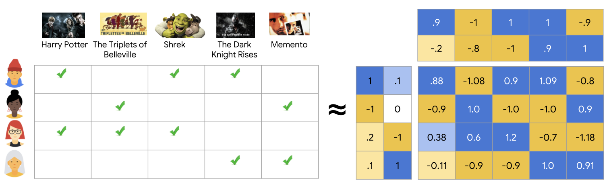
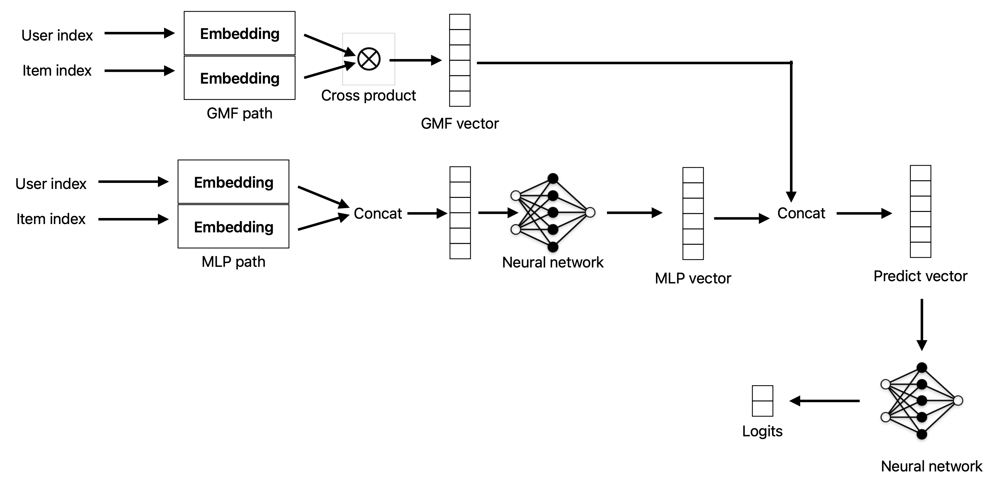

## Dataset

We are using MovieLens 1M (https://grouplens.org/datasets/movielens/1m/) dataset for the training of the recommender system. It was collected by the **GroupLens Research Project** and contains **1 million** movie ratings. This dataset contains about 6K users, 4K movies and each user rated at least 20 movies on a scale of 1-5 (integers).

The dataset contains three files: 
1. `ratings.dat`: Contains the rating each user gave to each movie
2. `users.dat`: Contains demographic data about users in the format `UserID::Gender::Age::Occupation::Zip-code`. *Example:* `1::F::1::10::48067` 
3. `movies.dat`: Contains movie titles and their associated genres in the format `MovieID::Title::Genre`.  *Example:* `1::Toy Story (1995)::Animation|Children's|Comedy`

*More information can be found [here](https://files.grouplens.org/datasets/movielens/ml-1m-README.txt)* 

We are converting ratings (1-5) into binary label representing whether the user liked the movie or not; we are using the heuristic that user liked they movie if they rated it $>= 4$.


## Collaborative Filtering

Collaborative filtering uses the similarities between users and items simultaneously to provide recommend items. To do se we represents users and items with a dense vector called embeddings with the hope that learning low-dimensional representations might capture preferences and similarities. We can then predict preference by simply doing the dot product of the user's and item's embedding.



*(Image credit: https://developers.google.com/machine-learning/recommendation/collaborative/matrix)*

The embeddings are typically learned by matrix factorization where we create a sparse matrix where row represents users and columns represent items we call this matrix feedback matrix $A \in \mathbb{R}^{m \times n}$. We then aim to learn two matrices $U  \in \mathbb{R}^{m \times d}$ (embeddings of user) and $V  \in \mathbb{R}^{n \times d}$ (embeddings of items).

We want to learn embeddings $U$ and $V$ such that $UV^{T}$ is a good approximation of $A$. We can do that by minimizing the following objective function: 
$$
\min_{U \in \mathbb R^{m \times d},\ V \in \mathbb R^{n \times d}} \sum_{(i, j) \in \text{obs}} (A_{ij} - \langle U_{i}, V_{j} \rangle)^2
$$

## Neural Collaborative Filtering

Collaborative Filtering learns low-dimensional “embeddings” (vectors) of users and items and predicts their interaction (e.g., rating) via a simple dot-product. NCF extends this by using a neural network to learn **both** a generalized matrix-factorization (GMF) path **and** a multi-layer perceptron (MLP) path, and then **combines** them. The hope is that the MLP can capture complex, non-linear user–item interactions that a dot-product alone can’t.




*(Architecture of Neural Collaborative Filtering)*

## Integrating Reinforcement Learning

A multi-armed bandit (MAB) is a sequential decision-making problem where an agent must choose among multiple options (arms), each giving a potentially different and unknown reward.


*(Illustration of exploitation vs exploration trade-off, image credit:  UC Berkeley AI course [slide](http://ai.berkeley.edu/lecture_slides.html), [lecture 11](http://ai.berkeley.edu/slides/Lecture%2011%20--%20Reinforcement%20Learning%20II/SP14%20CS188%20Lecture%2011%20--%20Reinforcement%20Learning%20II.pptx).)

The key **trade-off** in MAB problems is:
1. Exploration: trying out different arms to learn their reward distributions.
2. Exploitation: selecting the best-known arm to maximize immediate reward.

We can use MABs in recommender systems by represent user and their data as context and items to recommend as arms. MABs dynamically balance showing well-liked items (exploitation) with trying new ones to learn user preferences (exploration).

**Flow of multi-armed bandits**:
- $K$ arms, unknown reward distributions.
- At each round $t$, choose arm $a_t$, observe reward $r_t$.
- Goal: minimize **regret**, the gap between cumulative reward and that of always selecting the true best arm.
We can have various options for modeling the reward say for instance we can give positive reward if user end up interacting with the item.

#### LinUCB algorithm

1. The model assumes that the reward is linear:$$
	\mathbb{E}[r_{t,a}|x_{t,a}]=x_{t,a}^\top\theta_a^*$$
2. Estimated each arm's parameters via ridge regression on past context and rewards.
3. Computes Upper Confidence Bound for each arm:
$$p_{t,a}=x_{t,a}^\top\hat{\theta}_a+\alpha\sqrt{x_{t,a}^\top A_a^{-1}x_{t,a}}$$
4. Select arm with highest $p_{t,a}$ ,observe reward, and update $A_a$ and associated data

Here: 
1. $x_{t,a}$ is a context vector for each arm $a$ at time $t$ (e.g., user features, item metadata).
2. $A_{\alpha}$ is the regularized Gram matrix.
3. $\alpha$ is a hyper parameter that controls exploration.

## Results


**LinUCB:** Using heuristic reward function, rating predicted by NCF model + $\epsilon$, $\epsilon \sim \mathcal{N}(0, 0.01)$

```
Final Summary:
  Total Steps: 1000
  Final Cumulative Reward: 683.3557
  Final Average Reward: 0.6834
  Final Cumulative Regret: 312.7629
  Final Average Regret: 0.3128
```


## Running the programs

**Downloading and moving `ratings.dat` into the working directory**

```bash
wget https://files.grouplens.org/datasets/movielens/ml-1m.zip && 
unzip ml-1m.zip && 
rm -r ml-1m.zip
```

**Running NCF**

```bash
python3 train_test_ncf.py
```

**Running LinUCB**

```
python3 lin_ucb.py
```
